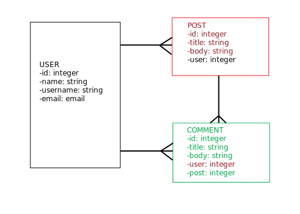

# From the Slums of J-SON

## Headline

From the Slums of JSON is a real REST API that anyone can use for prototyping or testing. Rather than some gibberish pseudo-Latin, it features the words and wisdom of the Wu-Tang Clan.

FSJ is a Python/Django/PostgreSQL that uses a hybrid of Django Rest Framework and some custom architecture to create a learning and testing resource for people building out REST projects. Unlike other services, FSJ users are indeed updating a real database and getting correct responses, which allows for more efficient cursory testing and even automated testing.

The homepage also serves in reverse as a Postman-like interface to test a user's own REST API.

## See It
The deployed version of the application can be viewed at [slumsofjson.herokuapp.com](http://slumsofjson.herokuapp.com).

## Run It
To run the application after downloading or cloning, simply install all the dependencies in requirements.txt and start the server with $ python3 manage.py runserver.

## ERD

